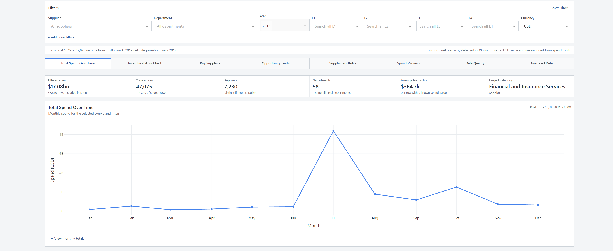
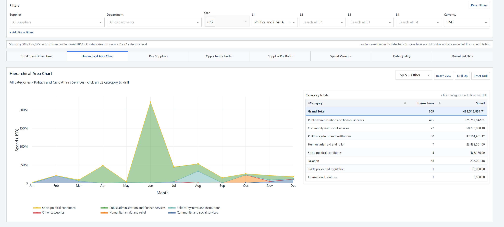
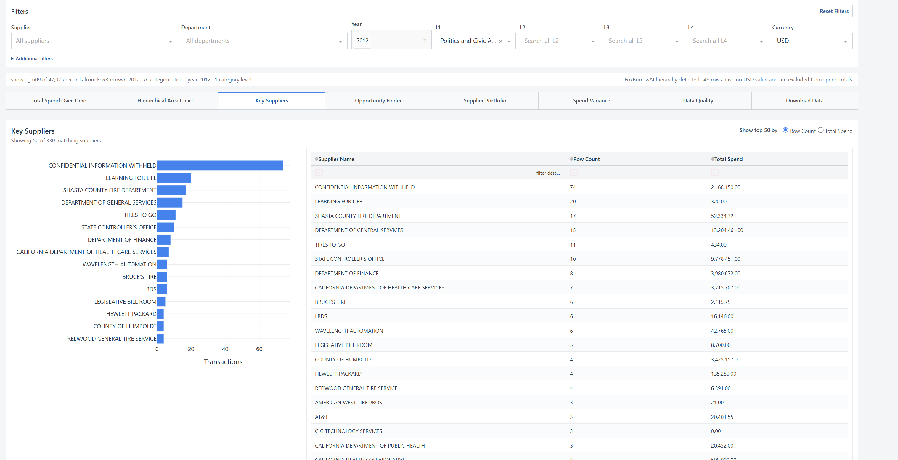
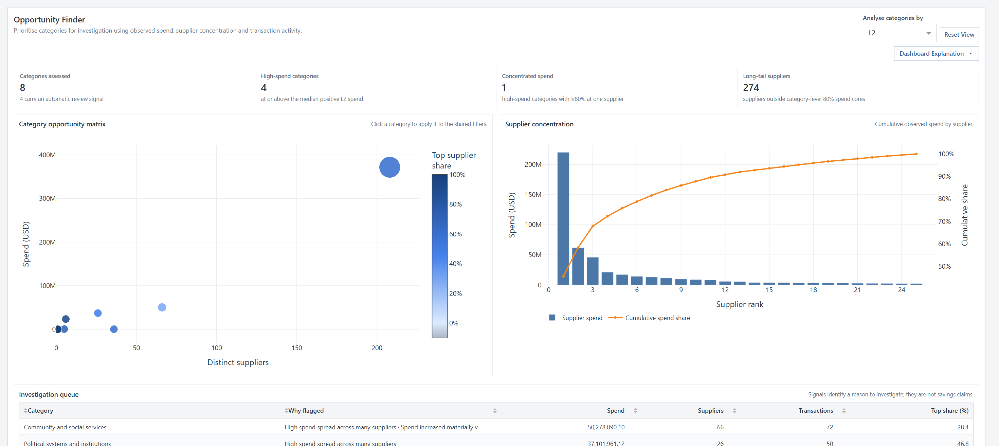
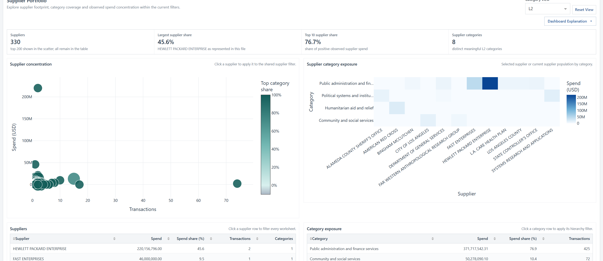
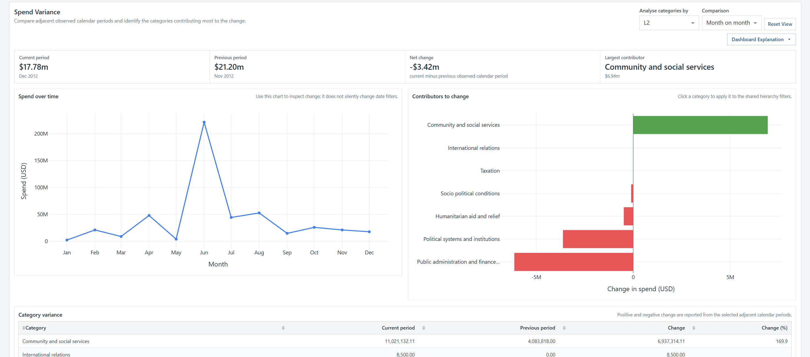
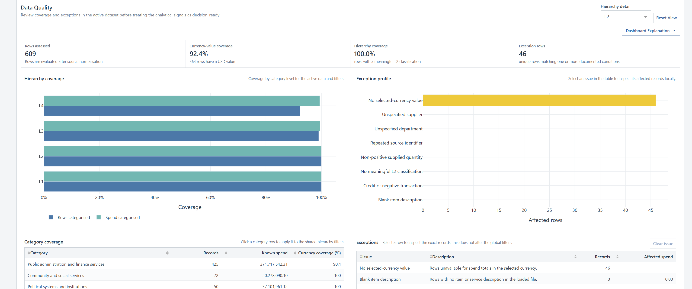

  

<h1 align="center">FoxBurrowAI</h1>

  <strong>Procurement categorisation and spend analysis for real-world data exports.</strong>

  Turn messy invoice and purchase-order data into structured, reviewable categories and useful analytical views.

  <a href="https://foxburrowai.com">Website</a> ·
  <a href="https://foxburrowai.com/dashboards.html">Dashboard showcase</a> ·
  <a href="https://github.com/AlexN159/FoxBurrowAI/releases/download/FoxburrowAI/FoxBurrowAI-Combined-Demo.zip">Download the combined demo</a> ·
  <a href="https://foxburrowai.com/contact.html">Contact</a>

> [!IMPORTANT]
> **This repository is a public showcase, not the FoxBurrowAI categorisation engine.**
>
> It contains the FoxBurrowAI website, dashboard screenshots and fixed demonstration data. It does **not** contain the proprietary categorisation workflow, an AI model, an upload API or a tool that categorises new files. The downloadable dashboard explores datasets that were prepared in advance.

## What FoxBurrowAI does

FoxBurrowAI is a procurement-data service built around a practical problem: real invoice and purchase-order exports are rarely clean enough to analyse immediately. Descriptions can be vague, supplier names inconsistent, columns irregular and existing category labels too broad to support useful decisions.

The separate FoxBurrowAI service can help organisations:

- normalise supplier, description, date and value fields from real spreadsheet exports;
- organise spend into a detailed L1–L4 hierarchy, including [UNSPSC](https://www.undp.org/unspsc)-aligned work where appropriate;
- provide reviewable category choices and explanations rather than an unexplained one-shot label;
- expose supplier, category, concentration, variance and data-quality signals; and
- deliver the resulting data with a tailored browser-based dashboard, including self-contained offline editions.

The public repository demonstrates the **outputs and analytical experience**. Categorising a new client dataset remains a separate FoxBurrowAI engagement.

## Try the combined dashboard demonstration

The free Windows demonstration contains two fixed, signed versions of the same 47,075 public-sector procurement records. Both can be selected within one local dashboard.

### [Download FoxBurrowAI-Combined-Demo.zip](https://github.com/AlexN159/FoxBurrowAI/releases/download/FoxburrowAI/FoxBurrowAI-Combined-Demo.zip)

To run it on Windows:

1. Download the ZIP and extract the complete folder.
2. Open the extracted `foxburrowai-public-demo-spend-explorer-r1` folder.
3. Double-click `OPEN DASHBOARD.cmd`.
4. Use the dataset selector to switch between the two categorisations.

The demonstration runs locally, requires no FoxBurrowAI account and does not need a connection to a FoxBurrowAI server. It is locked to its included signed datasets and cannot be repurposed to categorise or load arbitrary files.

## The comparison

The records stay the same; the category lens changes.

| Dataset | What it represents |
| --- | --- |
| **Government 2012 · human categorisation** | The original public-sector records with the government-supplied, human-assigned categories. |
| **FoxBurrowAI 2012 · AI categorisation** | The same records independently categorised by FoxBurrowAI so the alternative category structure can be inspected. |

This makes the difference visible across the same charts, tables and filters. The example is demonstration material, not government endorsement or a claim that either classification should be treated as ground truth without review.

## What the dashboard lets you explore

Supplier, department, year, category and currency filters are shared across the analytical views. Chart and table selections can feed those filters, allowing a question to be followed from a broad category down to the suppliers and transactions behind it.

| View | Procurement question |
| --- | --- |
| **Total Spend Over Time** | How much is being spent, when does it peak and what population is currently selected? |
| **Hierarchical Area Chart** | Which L1–L4 categories drive spend, and how does the mix change over time? |
| **Key Suppliers** | Which suppliers lead by transaction count or observed spend? |
| **Opportunity Finder** | Which categories combine material spend, supplier fragmentation or concentration signals worth investigating? |
| **Supplier Portfolio** | How concentrated is the supplier base, and where are suppliers exposed across categories? |
| **Spend Variance** | Which categories explain the change between adjacent months or quarters? |
| **Data Quality** | How complete are currency and hierarchy fields, and which exceptions need review? |
| **Download Data** | What records sit behind the current filtered view? |

These views surface areas to investigate; they do not make savings, compliance or sourcing decisions automatically.

<strong>View more dashboard screenshots</strong>

### Hierarchical category drill-down

### Key suppliers

### Opportunity Finder

### Supplier Portfolio

### Spend Variance

### Data Quality

## Example data in this repository

The public files make the demonstration inspectable outside the packaged dashboard:

- [`Cali_data_Original_Classification.csv`](data/Cali_data_Original_Classification.csv) — the original government-classified data.
- [`Cali_data_FoxBurrowAI_Retagged_Classification.xlsx`](data/Cali_data_FoxBurrowAI_Retagged_Classification.xlsx) — the FoxBurrowAI-retagged version of the same records.
- [`DetailedClassificationExamples.xlsx`](data/DetailedClassificationExamples.xlsx) — 100 example classifications with explanations.

These are example outputs for review. They are not a model release, training API, reproducible benchmark or mechanism for categorising additional data. Users should validate classifications, values and analytical signals before relying on them for procurement decisions.

## Public repository versus FoxBurrowAI service

| This public repository and demo | The separate FoxBurrowAI service |
| --- | --- |
| Static website source and imagery | Processing of a client’s own procurement exports |
| Fixed example datasets | Normalisation and categorisation of new data |
| Pre-built, locked Windows dashboard download | Reviewed data outputs and tailored dashboard delivery |
| Inspection of an existing comparison | Project-specific taxonomy, review and refresh requirements |
| No public model, pipeline or upload endpoint | Proprietary workflow operated as an agreed service |

## Working with your data

A typical project starts with a representative invoice, purchase-order or spend extract. FoxBurrowAI reviews the structure and business context, prepares the categorised output, and can package the approved data into a tailored dashboard. Client dashboards can be delivered with one or several authorised datasets and can run locally without user accounts or an always-on hosted service.

To discuss a dataset or request a demonstration:

- Visit [foxburrowai.com](https://foxburrowai.com)
- Use the [contact page](https://foxburrowai.com/contact.html)
- Email [info@foxburrowai.com](mailto:info@foxburrowai.com)

---

FoxBurrowAI is an independent project. References to public-sector data and UNSPSC-style classification do not imply endorsement by the source organisation or taxonomy owner.
